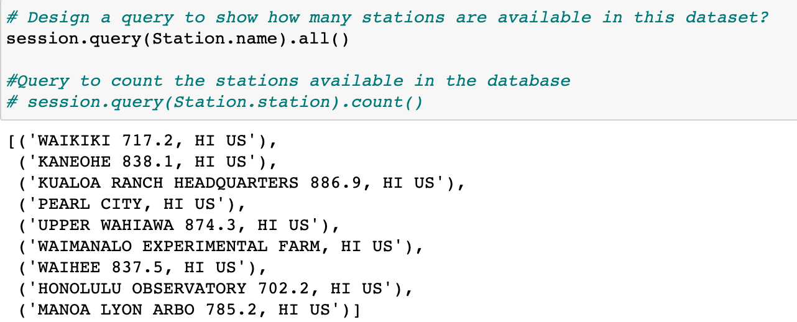

# SQLAlchemy Homework - Surfs Up!

## Background  
This repository is designed to make a climate analysis on Honolulu, Hawaii, to help clients trip planning, and outline when they can plan their vacation.

## Step 1 - Climate Analysis and Exploration

To begin, used Python and SQLAlchemy to do basic climate analysis and data exploration of the climate database. All of the following analysis completed using SQLAlchemy ORM queries, Pandas, and Matplotlib.

* Python SQL toolkit and Object Relational Mapper 
 -- import sqlalchemy 
 -- from sqlalchemy.ext.automap import automap_base 
 -- from sqlalchemy.orm import Session 
 -- from sqlalchemy import create_engine, func 

* SQLAlchemy engine created create_engine to connect to the sqlite database. 
  engine = create_engine("sqlite:///hawaii.sqlite")

* To reflect the tables into classes, and save a reference to those classes called Station and Measurement. 
  Base = automap_base() 
  Measurement = Base.classes.measurement 
  Station = Base.classes.station 

* Create our session (link) from Python to the DB 
  session = Session(engine) 

### Precipitation Analysis

* Designed a query to retrieve the last 12 months of precipitation data.Selected only the `date` and `prcp` values. 

* Loaded the query results into a Pandas DataFrame and set the index to the date column. 

* Sort the DataFrame values by `date`. 

* Plot the results using the DataFrame `plot` method. 

* Used Pandas to print the summary statistics for the precipitation data. 

### Station Analysis

* Designed a query to calculate the total number of stations. 

* Designed a query to find the most active stations. 

* Designed a query to retrieve the last 12 months of temperature observation data (TOBS) of the most active station and plotted the results as a histogram with `bins=12`. 

- - -

## Step 2 - Climate App

* Used Flask to create routes which are as follow:

### Routes

* `/`

  * Home page.

  * List all routes that are available.

* `/api/v1.0/precipitation`

  * Convert the query results to a dictionary using `date` as the key and `prcp` as the value.

  * Return the JSON representation of the dictionary.

* `/api/v1.0/stations`

  * Return a JSON list of stations from the dataset.

* `/api/v1.0/tobs`
  * Query the dates and temperature observations of the most active station for the last year of data.
  
  * Return a JSON list of temperature observations (TOBS) for the previous year.
  

* `/api/v1.0/<start>` and `/api/v1.0/<start>/<end>`

  * Return a JSON list of the minimum temperature, the average temperature, and the max temperature for a given start or start-end range.

  * When given the start only, calculated `TMIN`, `TAVG`, and `TMAX` for all dates greater than and equal to the start date.

  * When given the start and the end date, calculated the `TMIN`, `TAVG`, and `TMAX` for dates between the start and end date inclusive.

## Temperature Analysis II 
The calc_temps function used to calculate the min, avg, and max temperatures for the trip using the matching dates from the previous year (i.e.,"2017-01-01" if the trip start date was "2018-01-01").

The min, avg, and max temperature from the previous query used to plot a bar chart, the average temperature used as the bar heigh, and the peak-to-peak (TMAX-TMIN) value as the y error bar (YERR). The plot looks as follows: 

## Daily Rainfall Average
The rainfall per weather station, and the daily normals are calculated, normals are the averages for the min, avg, and max temperatures. A function called daily_normals is used to calculate the daily normals for a specific a given date list for the trip. This dates string are in the format of %m-%d. The list of daily normals also loded into a Pandas DataFrame, indexed equal to the date, and an area plot is conducted (stacked=False) for the daily normals. The plot looks as follow: 

